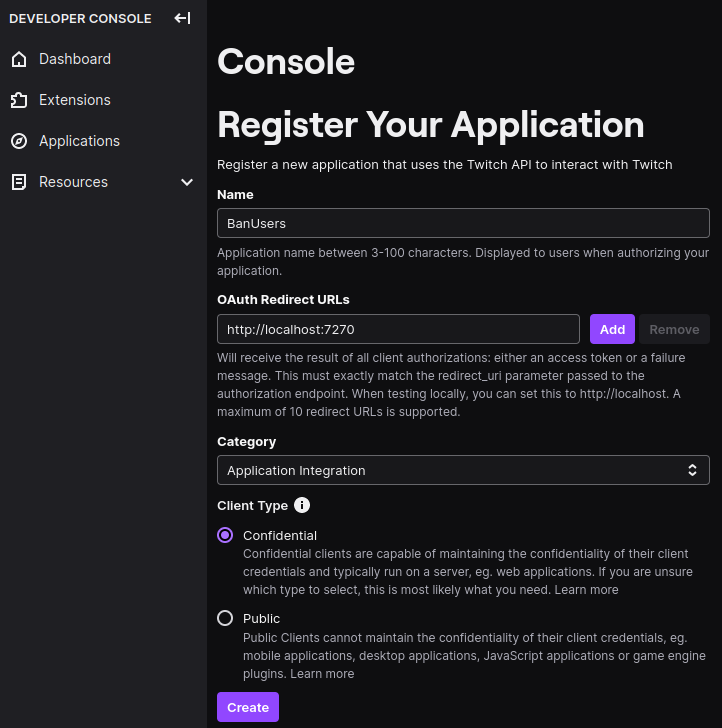

# Twitch Ban Recent Users

In case you get a bot/hate raid you can use the following program to ban all of them automatically.

## Instructions

1. Create `credentials.json` by copying [`credentials_example.json`](credentials_example.json) and inserting your own `clientId` and `clientSecret` after registering an application to the Twitch dev console

   

   ```json
   {
        "clientId": "GET THIS FROM https://dev.twitch.tv/console/apps",
        "clientSecret": "GET THIS FROM https://dev.twitch.tv/console/apps",
        "scopes": [
            "chat:read",
            "chat:edit",
            "moderator:read:followers",
            "moderator:manage:banned_users"
        ],
        "redirectPort": 7270
    }
    ```

2. Create `arguments.json` by copying [`arguments_example.json`](arguments_example.json) and inserting your own `channelName`, `banReason`, `userNamesToBan` and the number of minutes where followers should be banned (`banUsersWhoFollowedInTheLastMinutes`)

   ```json
    {
        "channelName": "TODO Insert your own channel",
        "banReason": "TODO Delete or add your own reason",
        "userNamesToBan": [],
        "banUsersWhoFollowedInTheLastMinutes": 20,
        "dryRun": true,
        "verbose": true
    }
    ```

    > **Run this program at least once with `dryRun = true` to verify that the right followers will be banned!**

3. Run the program:

   ```sh
   npm install
   npm run compile
   npm run start
   ```

## TODOs

### Binary

The current binary has a problem with a dynamic ESM import so it's only usable after the initial token was fetched (= unusable).

```sh
npm install
npm run compile
npm run pkg
# Linux
./bin/banbots-linux-x64
```

```powershell
# Windows
.\bin\banbots-win-x64.exe
```
